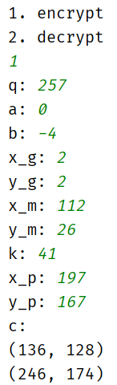
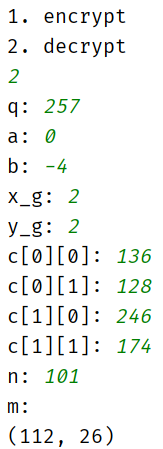
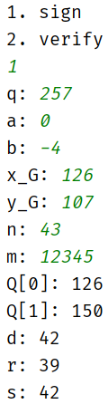
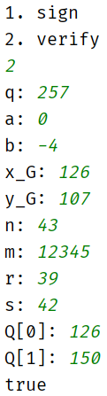
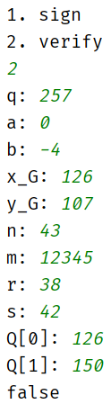
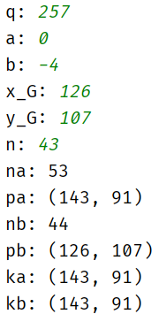

包括一个简单的ECC加解密、椭圆曲线数字签名算法、基于ECC的DH密钥交换。

#### 一、基于ECC的加解密

##### 1. 算法原理

这可能是最简单的一种用椭圆曲线实现加解密的方法。首先，将要发送的消息明文m编码为形为(x,y)的点P~m~，并对点P~m~进行加密和其后的解密。为了简化编码过程，这里将点P~m~作为消息。

##### 2. 算法流程

在加解密时需要用到椭圆曲线上的运算，所以首先要构造ECC类，包括ECC上的加减法以及数乘运算。

加密过程为$C=\{kG,M+kP\}$，其中$k$是随机选择的正整数，$G$为椭圆曲线上的一个点，$M$为待加密的消息，公钥为$P=n×G$，$n$为私钥。$q,a,b,G$是全局参数。

伪代码如下：

```c
encrypt(q,a,b,G,M,k,P):
C[0] = k×G;
C[1] = M + k×P;
return C;
```

其中$q,a,b$是椭圆曲线的参数。

解密过程为$M=C[1]-n×C[0]$。

伪代码如下：

```c
decrypt(q,a,b,C,n):
M = C[1] - n×C[0];
return M;
```

##### 3. 测试样例及运行结果

全局参数：$q=257$，$a=0$，$b=-4$，$G=(2,2)$。

加密，随机数$k=41$，消息$M=(112,26)$，公钥$P=(197,167)$：



解密，密文$C=\{(136,128),(246,174)\}$，私钥$n=101$：



##### 4. 总结

这个加解密算法原理比较简单，但是非常依赖椭圆曲线的相关运算。所以主要难点就是椭圆曲线的有关计算。在加法运算中，要考虑不同情况，有一个零点、坐标相同且不为零、坐标相同且纵坐标为零、横坐标相同纵坐标不同这四种情况要分开考虑，但是最开始只考虑了坐标相同和不相同两种，在后续调试过程中出了很多问题。在数乘运算中，还要考虑乘数为1的情况。这里使用了递归的方法，减少计算次数。

#### 二、椭圆曲线数字签名算法

##### 1. 算法原理

椭圆曲线数字签名算法（ECDSA）是使用椭圆曲线密码（ECC）对数字签名算法（DSA）的模拟。ECDSA于1999年成为ANSI标准，并于2000年成为IEEE和NIST标准。

##### 2. 算法流程

基于椭圆曲线的算法都需要构造椭圆曲线，因此需要全局参数$q,a,b,G,n$，其中$q,a,b$为椭圆曲线参数，$G$为椭圆曲线的一个基点，$n$为点$G$的阶，要求$n$为素数。

密钥产生流程如下：

```flow
st=>start: 开始
op1=>operation: 随机选择整数d，1<=d<=n-1
op2=>operation: 计算Q=dG
out=>inputoutput: 私钥d
公钥Q
st->op1->op2->out
```

伪代码如下：

```c
generateKey():
d = random(1,n-1);
Q = d×G;
return Q,d;
```

签名流程如下：

```flow
st=>start: 输入消息M，私钥d
op1=>operation: 选择随机数k(1<=k<=n-1)
op2=>operation: 计算P = k×G
op3=>operation: 计算r = P[0] % n，若r=0重新选取k
op4=>operation: 计算t=k^(-1) mod n
op5=>operation: 计算e=H(M)
op6=>operation: 计算s=t×(e+dr)，若s=0重新选取k
out=>inputoutput: 签名(r,s)
st->op1->op2->op3->op4->op5->op6->out
```

伪代码如下：

```c
sign(M,d):
while(true)
    k = random(1,n-1);
	P = k×G;
	r = P[0]%n;
	if r==0
        continue;
	t = k^(-1) mod n;
	e = H(M);
	s = t(e+dr)%n;
	if s==0
        continue;
	else
        break;
return r,s;
```

验证签名流程如下：

```flow
st=>start: 输入消息m，签名r,s，公钥Q
con1=>condition: 检验是否
1<=r,s<=n-1
op1=>operation: 计算e=H(m)
op2=>operation: 计算w=s^(-1) mod n
op3=>operation: 计算u1=ew，u2=rw
op4=>operation: 计算X=u1*G+u2*Q
con2=>condition: 检验是否X=O
op5=>operation: 计算v=x1%n
con3=>condition: 检验是否v=r
true=>inputoutput: 返回true
false=>inputoutput: 返回false
st->con1
con1(yes)->op1->op2->op3->op4->con2
con1(no)->false
con2(yes)->op5->con3
con2(no)->false
con3(yes)->true
con3(no)->false
```

伪代码如下：

```c
verify(M,r,s,Q):
if !(1<=r,s<=n-1)
    return false;
e = H(M);
w = s^(-1) mod n;
u1 = ew;
u2 = rw;
X = u1*G + u2*Q;
if X==O
    return false;
v = x1%n;
return v==r;
```

##### 3.测试样例及运行结果

全局参数：$q=257$，$a=0$，$b=-4$，$G=(126,107)$，$n=43$。

签名，消息：12345：



签名验证，公钥$Q=(126,150)$：



将r的最后一位改为8，未通过验证：



##### 4. 总结

这个实验要注意几个地方。一是点$G$的阶要为素数，否则可能出现无法求逆元的情况。二是计算数乘是要考虑乘数为1的情况。三是加法会遇到两个点纵坐标都为0的情况，此时和为O，不能直接用公式。

#### 三、 基于ECC的DH密钥交换

##### 1. 算法原理

Whitfield Diffie与Martin Hellman在1976年提出了一个奇妙的密钥交换协议，称为Diffie-Hellman密钥交换协议/算法(Diffie-Hellman Key Exchange/Agreement Algorithm)。这个机制的巧妙在于需要安全通信的双方可以用这个方法确定对称密钥。

##### 2. 算法流程

全局参数包括$q,a,b,G,n$，其中$q,a,b$为椭圆曲线参数，$G$为椭圆曲线的一个基点，$n$为点$G$的阶。

密钥产生流程为


```flow
st=>start: 开始
op1=>operation: 随机选择整数na，1<=na<=n-1
op2=>operation: 计算P=na*G
out=>inputoutput: 私钥na
公钥P
st->op1->op2->out
```

伪代码如下：

```c
generateKey():
na = random(1,n-1);
Pa = na×G;
return na,Pa
```

产生秘密钥过程为$K=na×Pb=nb×Pa$。

伪代码如下：

```c
secretKey(Pb):
return na*Pb;
```

##### 3.测试样例及运行结果

全局参数：$q=257$，$a=0$，$b=-4$，$G=(126,107)$，$n=43$。

产生的公私钥及秘密钥：



##### 4. 总结

此算法与普通的Diffie-Hellman密钥交换相似，只是计算变为了椭圆曲线上的运算，而且这里的密钥是一对数字。该算法没有比较大的困难。

#### 四、收获与建议

椭圆曲线密码学是一种基于椭圆曲线数学的密钥加密算法，因此依赖于椭圆曲线。ECC被广泛认为是在给定密钥长度的情况下，最强大的非对称算法。

ECC的优点在于同等安全性下密钥更短，RSA的优点在于运算更加简单。